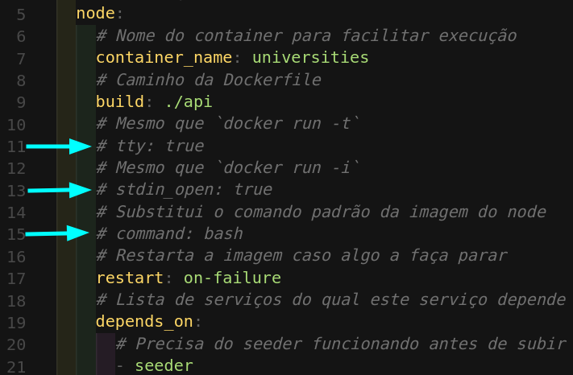

# Projeto Integrado

Este projeto é resultado do desafio técnico Back-End proposto pela empresa Bis2Bis. O desafio consistia de duas partes:

- Parte 1: criar um script para captar dados providos por uma API externa e salvar tais dados no banco de dados.
- Parte 2: Criar uma API que providencie um CRUD (create,‌ ‌retrieve,‌ ‌update,‌ ‌delete)‌‌
  das‌ ‌universidades‌ ‌anteriormente‌ ‌cadastradas‌ ‌no‌ ‌banco de dados.‌

O script relacionado à parte 1 do desafio se encontra no diretório **/seeder**. Já a API que implementa o CRUD se encontra no diretório **/api**.

No restante dessa documentação são apresentadas informações como as tecnologias e arquitetura utilizadas no projeto, a documentação da API e guias de como rodar a aplicação em sua máquina.

**OBS.**:Para facilitar a navegação na documentação do projetos, sugiro utilizar a ferramenta provida pelo Github:


## Tecnologias utilizadas

Na sequeência são listadas as principais tecnologias utilizadas para a implementação do projeto. Inicialmente são apresentadas as utilizadas para o desenvolvimento da aplicação:

- [Express](https://expressjs.com/): web framework para construir APIs com Node.js.
- [Mongoose](https://mongoosejs.com): é uma biblioteca JavaScript com orientação a objetos que cria uma conexão entre o banco de dados MongoDb e uma aplicação com Node.js.
- [TypeScript](https://www.typescriptlang.org): é um superset do JavaScript que adiciona tipagem estática à linguagem.
- [Zod](https://www.npmjs.com/package/zod): é uma biblioteca para validação de dados.
- [Helmet](https://geopy.readthedocs.io/en/stable/index.html?highlight=geodesic#): é uma biblioteca para aprimorar a segurança de aplicações criadas em Express que adiciona HTTP header à aplicação.
- [Cors](https://www.npmjs.com/package/cors): é um pacote Node.js que prove um middleware utilizado para habilitar CORS (Cross-Origin Resource Sharing).
- [ESLint](https://eslint.org/) para padronização do código.

Para a implementação dos testes unitários foram utilizadas:

- [Mocha.js](https://mochajs.org/): é um framework JavaScript para criar testes assíncronos.
- [Sinon.js](https://sinonjs.org/): utilizado para realizar o stub de funções.
- [Chai](https://www.chaijs.com/): é uma biblioteca de asserção, que torna os testes mais legíveis.

Para a implementação do banco de dados se utilizou o [MongoDB](https://www.mongodb.com/), o qual rodou a partir de um container local. Todavia, outra opção é utilizar o serviço [Atlas](https://www.mongodb.com/atlas).

## Documentação da API

A documentação da API foi construída utilizando a ferramenta Postman. Você pode acessar a última versão através deste [link](https://documenter.getpostman.com/view/21397186/2s7ZEBnMex). Na documentação você tem acesso a todas as rodas, bem como a exemplos de requisições a cada rota.

## Organização e Arquitetura

A aplicação tentou aplicar a filosofia **SOLID** em conjunto com a arquitetura **MSC** e **orientação a objetos**. Assim, interfaces foram utilizadas para contruir a abstração da aplicação e garantir a inversão de dependências. Ademais, arquivos relacionados ao model (M) tem por objetivo possibilitar a conexão e interação com o banco de dados, já arquivos do service (S) performam ações de validação das regras de negócio e validação e, por fim, arquivos relacionados ao controller (C) se destinam a fazer a interface com as requisições externas a aplicação. Essa segregação é mais fácil observada analisando a estrutura da API apresentada a seguir:

```
📦src
 ┣ 📂controllers
 ┃ ┗ 📜University.ts
 ┣ 📂errors
 ┃ ┗ 📜catalog.ts
 ┣ 📂helper
 ┃ ┗ 📜objKeyConvertion.js
 ┣ 📂interfaces
 ┃ ┣ 📜IModel.ts
 ┃ ┣ 📜IModelUniversity.ts
 ┃ ┣ 📜IService.ts
 ┃ ┣ 📜IServiceUniversity.ts
 ┃ ┗ 📜IUniversity.ts
 ┣ 📂middleware
 ┃ ┗ 📜error.ts
 ┣ 📂models
 ┃ ┣ 📜MongoModels.ts
 ┃ ┣ 📜Universities.ts
 ┃ ┗ 📜connections.ts
 ┣ 📂routes
 ┃ ┗ 📜University.ts
 ┣ 📂services
 ┃ ┗ 📜University.ts
 ┣ 📂tests
 ┃ ┣ 📂mocks
 ┃ ┃ ┗ 📜universityMock.ts
 ┃ ┗ 📂unit
 ┃ ┃ ┣ 📂controllers
 ┃ ┃ ┃ ┗ 📜university.test.ts
 ┃ ┃ ┣ 📂models
 ┃ ┃ ┃ ┗ 📜university.test.ts
 ┃ ┃ ┗ 📂services
 ┃ ┃ ┃ ┗ 📜university.test.ts
 ┣ 📜app.ts
 ┗ 📜index.ts
```

## Rodando o Projeto na Sua Máquina

Para você rodar o projeto na sua máquina é necessário que sejam satisfeitas as seguintes condições:

- Sistema Operacional Distribuição Unix
- Node versão 16 (versão igual ou superior à `16.15.0 LTS`)
- Docker
- Docker-compose versão >=1.29.2

A seguir você encontra um guia de como instalar e rodar o projeto localmente. Em caso de dúvidas, problemas ou feedbacks, entre em contato.

Passo 1. Crie o repositório local utilizando `mkdir`:

```bash
mkdir projeto-integrado
```

Passo 2. Mude para o repositório criado:

```bash
cd projeto-integrado
```

Passo 3. Clone o projeto utilizando a chave SSH:

```bash
git clone git@github.com:heitortessaro/Integrado.git
```

Passo 4. Mude para o diretório clonado:

```bash
cd Integrado
```

Passo 5. Rode os containers da aplicação

```bash
docker-compose up -d
```

Ao rodar o Passo 5, as imagens relacionadas a cada um dos dockerfiles (banco de dados, API, scrept seeder) serão baixadas e depois as aplicações serão inicializadas. As configurações definidas no arquivo docker-compose, presente na raíz do projeto, estabelecem a seguinte sequência de inicialização:

- **Banco de dados**, com a porta **27017** exposta.
- **Seeder**, com a porta 3002 exposta. Esse container é finalizado após o script ter capturado os dados externos e enviado para o banco de dados.
- **API**, com a porta **3001** exposta.

Caso você deseje finalizar as aplicações, basta utilizar o seguinte comando para "derrubar" os containers:

```bash
docker-compose down
```

### Rodando Testes Unitários

Testes unitários foram construídos para as camadas da arquitetura MSC (models, services e controllers). Para rodar os testes localmente é necessário que uma alteração no arquivo **docker-compose** seja realizada. Assim, abra o arquivo **docker-compose** e descomente as linhas 11, 13 e 15.



Assim, o comando _npm start_ não irá iniciar a aplicação da API ao subir o respectivo contair.

Feitas as alterações indicadas no arquivo **docker-compose**, é necessário que você siga os seguintes passos para rodas os testes unitários:

Passo 1. Rode os containers da aplicação:

```bash
docker-compose up -d
```

Passo 2. Rode o seguinte comando para acessar o terminal do container com a aplicação da API.

```bash
docker exec -it universities bash
```

Passo 3. Por precaução, certifique-se de que as dependências estão instaladas, rodando:

```bash
npm install
```

Passo 4. Rode o comando que executa os testes unitários:

```bash
npm run test:dev
```

Os testes devem ser executados e os resultados apresentados no próprio terminal.

**Importante!** lembre-se de comentar as linhas 11, 13 e 15 após finalizar a análise dos testes da aplicação.
